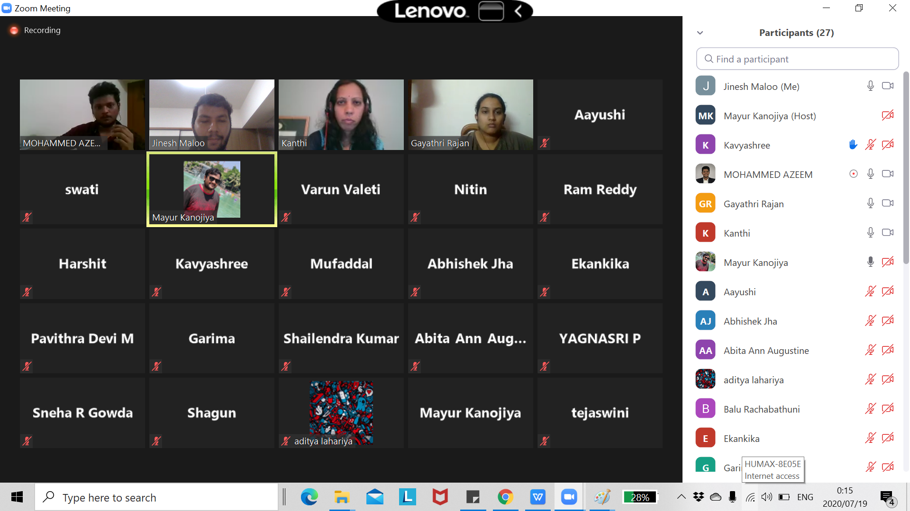
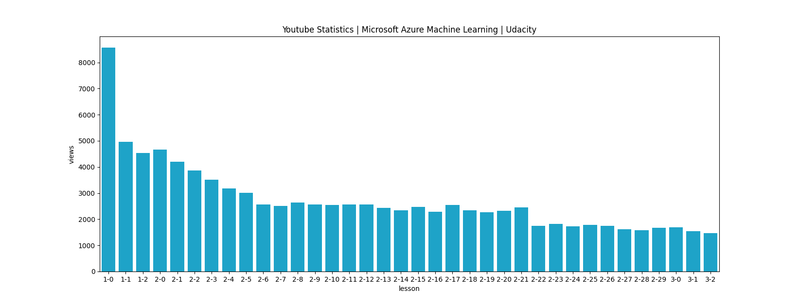
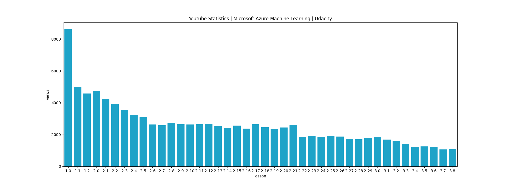

# Microsoft-Machine-Learning-Scholarship

## 50 Days of Udacity Challenge

##### 13, July 2020
- D1: Completed Introduction L1

##### 14, July 2020
- D2: Completed L2 upto 10

##### 15, July 2020
- D3: Completed L2 up to 16.

##### 16, July 2020
- D4: L2 up to 25
	- Cloud services for Machine Learning
	- Overview of Azure ML Studio
	- Differences between Model vs Algorithm
	- Learned the basics of Linear Regression
		- Linear Assumption
		- Remove Noise
		- Remove collinearity (correlated features)
		- Gaussian distributions
		- Rescale inputs
	- Lab 1 of LinearRegression complete.
		- Learned about RDP gateway
	First time in ML/DL, I experienced design studios like Android Studio and XCode, Kudos to the team of @Microsoft Azure to come up with such drag and drop concept that will help the non-coding background people :+1::clapping-inclusive::clapping-inclusive::clapping-inclusive:
	Attached: Android Studio's drag and drop design studio for reference.
	Also learned, how RDP gateway works in the browser. :face_with_monocle:
	Encouraging: @Aarthi Alagammai @Richa @Pooja Tope-Puranik @Veena @Viji @geax @Harshit Rai  :yay::bhangra:

##### 17, July 2020
- D5: L2 Complete
- Created Youtube Statistics App
    
    <u>Description:-</u>
    
    The app gather the information from Youtube API. The information are stored into .csv files. 
    
    Pandas, Matplotlin and seaborn used to create plot from the availlable data.
    
    <u>Use:-</u>
    
    It provides the overall estimate or trend that tells how much people are actively learning on Udacity.
    
     
    
    

##### 18, July 2020
- D6: L3 upto 5
- Zoom meet with #sg_connecting_the_dots_with_ml mates 
      
- Today's stats
      
  
  
##### 19, July 2020
- D7: L3 5 to 10
- Zoom meet with project team to discuss ideas      
- Today's stats
      
      
##### 20, July 2020
- D8: L3 10 to 16
- Learned the importance of feature engineering and feature selection and completed on lab on it
- Today's stats
      
  
