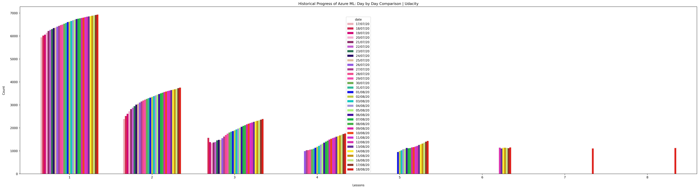

# Microsoft-Machine-Learning-Scholarship

## 50 Days of Udacity Challenge

##### 13, July 2020
- D1: Completed Introduction L1

##### 14, July 2020
- D2: Completed L2 upto 10

##### 15, July 2020
- D3: Completed L2 up to 16.

##### 16, July 2020
- D4: L2 up to 25
	- Cloud services for Machine Learning
	- Overview of Azure ML Studio
	- Differences between Model vs Algorithm
	- Learned the basics of Linear Regression
		- Linear Assumption
		- Remove Noise
		- Remove collinearity (correlated features)
		- Gaussian distributions
		- Rescale inputs
	- Lab 1 of LinearRegression complete.
		- Learned about RDP gateway
	First time in ML/DL, I experienced design studios like Android Studio and XCode, Kudos to the team of @Microsoft Azure to come up with such drag and drop concept that will help the non-coding background people :+1::clapping-inclusive::clapping-inclusive::clapping-inclusive:
	Attached: Android Studio's drag and drop design studio for reference.
	Also learned, how RDP gateway works in the browser. :face_with_monocle:
	Encouraging: @Aarthi Alagammai @Richa @Pooja Tope-Puranik @Veena @Viji @geax @Harshit Rai  :yay::bhangra:

##### 17, July 2020
- D5: L2 Complete
- Created Youtube Statistics App
    
    <u>Description:-</u>
    
    The app gather the information from Youtube API. The information are stored into .csv files. 
    
    Pandas, Matplotlin and seaborn used to create plot from the availlable data.
    
    <u>Use:-</u>
    
    It provides the overall estimate or trend that tells how much people are actively learning on Udacity.
    
     
    
    

##### 18, July 2020
- D6: L3 upto 5
- Zoom meet with #sg_connecting_the_dots_with_ml mates 
      
- Today's stats
      
  
  
##### 19, July 2020
- D7: L3 5 to 10
- Zoom meet with project team to discuss ideas      
- Today's stats
      
      
##### 20, July 2020
- D8: L3 10 to 16
- Learned the importance of feature engineering and feature selection and completed on lab on it
- Today's stats
      

##### 21, July 2020
- D9: L3 up to 20
- Learned Data drift and model training process 
- Learned Taxonomy of Azure Machine Learning
- Attended group meeting of #sg_connecting_the_dots_with_ml on Social
- Attended last 10 minutes of group meeting of #sg_connecting_the_dots_with_ml on HealthCare
- Today's stats
      

##### 22, July 2020
- D10: L3 up to 25
- Created one process diagram for Semantic Analysis on text data
- Learned Model Evaluation techniques.
      
- Diffrentiate between Receiver Operating Characteristics (ROC) and Area Under the Curve (AUC)
- Today's stats
      
  
##### 23, July 2020
- D11: Just learned one lecture 3.26 because next chapter is important as that is the thing that we are going to so many times.
- Meeting with project mates for updates
      
- Created one notebook for EDA
- Today's stats
      
 
 
##### 24, July 2020
- D12: L3 upto 30 (Ensemble Learning)
- Created new plots based on historical data collected through daily stats
- Total Counf of Views On Each Day (Not accurate as I am still on 3rd lesson)
            
- Historical Udacity Views Plot
            
- Today's stats
      

 
##### 25, July 2020
- D13: Completed the pending labs of L3
- EDA on environ email dataset for our semantic analysis project  
  GitHub : [Email Semantic Analysis](https://github.com/Connecting-the-Dots-with-ML/Email-Semantic-Analysis/blob/master/Exploratory%20Data%20Analysis_mayur.ipynb)
- Historical Udacity Views Plot
            
- Today's stats
      

 
##### 26, July 2020
- D14: L4 Started and completed upto 3
- Historical Udacity Views Plot
            
- Today's stats
      

##### 27, July 2020
- D15: Completed L4 up to 10 
- Historical Udacity Views Plot
            
- Today's stats
      

##### 28, July 2020
- D16: Completed L4 up to 15
- Historical Udacity Views Plot (Grouped by lesson)
            
- Today's stats
      

##### 29, July 2020
- D17: Completed L4 up to 20
- Historical Udacity Views Plot (Grouped by lesson)
            
- Today's stats
      
  
##### 30, July 2020
- D18: Completed L4 up to 23
- Historical Udacity Views Plot (Grouped by lesson)
            
- Walked 2.5 km 
            
- Today's stats
      

##### 31, July 2020
- D19: Completed L4
- Historical Udacity Views Plot (Grouped by lesson)
            
- Walked 4.9 km 
            
- Today's stats
      
      
      
##### 1, August 2020
- D20: Completed L5 upto 3
- Company's friendship day meeting
            
- Historical Udacity Views Plot (Grouped by lesson) [Bug: Sorting by date]
            
- Today's stats
      
- Walked 3 km 
            
      
 
##### 2, August 2020
- D21: Completed L5 upto 3
- HealthCare Project Meeting
            
- Historical Udacity Views Plot (Grouped by lesson) [Bug: Sorting by date]
            
- Today's stats
      
- Walked 3 km 
            

 
##### 3, August 2020
- D22: Completed L5 upto 6
- Learned that groupby and pivot destroys the date sorting so for groupby we have to specify
    
        sort=False and for pivot, we have to reindex the table by sorting the date columns
- Historical Udacity Views Plot (Grouped by lesson)
            
- Today's stats
      

Fitness Day: 5      
- Walked 3 km 
            

##### 4, August 2020
- D23: Consumed with company work and right now may be tired or not feeling well so not going through courses
- Historical Udacity Views Plot (Grouped by lesson) [Bug: Fixed]
            
- Today's stats
      

Fitness Day: 6      
- Walked 3 km 
        
      
##### 5, August 2020
- D24: Completed L5 up to 10
- Some EDA on subject of the email [Email Semantic Analysis](https://github.com/Connecting-the-Dots-with-ML/Email-Semantic-Analysis/blob/master/Exploratory%20Data%20Analysis_mayur.ipynb)
- Historical Udacity Views Plot (Grouped by lesson)
            
- Today's stats
      

Fitness Day: 7      
- Walked 3 km 
            

##### 6, August 2020
- D25: 
  - Started NLP on [email semantic analysis](https://github.com/Connecting-the-Dots-with-ML/Email-Semantic-Analysis) project of  #sg_connecting_the_dots_with_ml 
  - Did some EDA on [SIIM-ISIC Melanoma](https://www.kaggle.com/kmknation/siim-isic-melanoma-understanding?scriptVersionId=40270393) for [skin cancer detection](https://github.com/Connecting-the-Dots-with-ML/skin-cancer-detection) project of  #sg_connecting_the_dots_with_ml 
- Historical Udacity Views Plot (Grouped by lesson)
            
- Today's stats
      

Fitness Day: 8      
- Walked 3 km 
            

##### 7, August 2020
- D26: 
  - Removed stop words in email dataset [email semantic analysis](https://github.com/Connecting-the-Dots-with-ML/Email-Semantic-Analysis) project of  #sg_connecting_the_dots_with_ml 
  - Starting the Forecasting Project for next 25 days udacity views
  - Completed L5 upto 15  
- Historical Udacity Views Plot (Grouped by lesson)
            
- Today's stats
      

Fitness Day: 9
- Walked 3.39 km 
            

##### 8, August 2020
- D27: 
  - Stemming and Lemmatization on email dataset [email semantic analysis](https://github.com/Connecting-the-Dots-with-ML/Email-Semantic-Analysis) project of  #sg_connecting_the_dots_with_ml 
  - Completed L5 upto 18  
  - Weekly Meet about How to improve more through WFH in upcoming months.
- Historical Udacity Views Plot (Grouped by lesson)
            
- Historical Udacity Progress Plot (Grouped by lesson)
            
- Today's stats
      

Fitness Day: 10
- Walked 2.36 km 
            
      

##### 9, August 2020
- D28: 
  - Completed L5 upto 18  
  - Doing some forecasting based on mean_absolute_percentage_error metric on Udacity Azure ML courses.
       
  - Weekly Meet with Project mates of [email semantic analysis](https://github.com/Connecting-the-Dots-with-ML/Email-Semantic-Analysis) and explained the past work and what we will going to do in future.
  - Weekly Meet with Project mates of [Skin Cancer Detection](https://www.kaggle.com/kmknation/siim-isic-melanoma-understanding) and explained the past work and what we will going to in future. 
  - Historical Udacity Views Plot (Grouped by lesson)
            
  - Historical Udacity Progress Plot (Grouped by lesson)
            
  - Today's stats
      

Fitness Day: 11
- Walked 4.38 km 
            
      

##### 10, August 2020
- D29: 
  - Completed L5 upto 21  
  - Historical Udacity Views Plot (Grouped by lesson)
            
  - Historical Udacity Progress Plot (Grouped by lesson)
            
  - Today's stats
      

Fitness Day: 12
- Walked 3 km 
            
      

##### 11, August 2020
- D30: 
  - Completed L5
  - Created some visuals for #visual_challenge_gallery 
    1. Udaicty Collage
        
        
    2. My Face in the eye of Deep Learning
        
    
    3. Historical Udacity Views Plot (Grouped by lesson)
            
  
    4. Historical Udacity Progress Plot (Grouped by lesson)
            
      
    5. Progress Animated Video
      
  - Today's stats
      

Fitness Day: 12
- Walked 3 km 
            

      

##### 12, August 2020
- D31: 
  - Completed L6 upto 5 (I will complete other leesons in 7 days now)
  - Historical Udacity Views Plot (Grouped by lesson)
            
  - Historical Udacity Progress Plot (Grouped by lesson)
            
  - Today's stats
      

Fitness Day: 13
  - Took break due to heavy rain
  
  
##### 13, August 2020
- D32: 
  - Completed L6 upto 12
  - Historical Udacity Views Plot (Grouped by lesson)
            
  - Historical Udacity Progress Plot (Grouped by lesson)
            
  - Today's stats
      

Fitness Day: 13
  - 2.06 km
              

  
  
##### 14, August 2020
- D33: 
  - Got busy in office's deep learning model troubleshooting in production so had no time for udacity. However creating plots for today's date
  - Historical Udacity Views Plot (Grouped by lesson)
            
  - Historical Udacity Progress Plot (Grouped by lesson)
            
  - Today's stats
      

Fitness Day: 14
  - 4 km
            

  
##### 15, August 2020
- D34: 
  - Attended Independence Day Meet
  - Attended Discussion about project presentation
  - Paticipated in Study Jam
  - Historical Udacity Views Plot (Grouped by lesson)
            
  - Historical Udacity Progress Plot (Grouped by lesson)
            
  - Today's stats
      

Fitness Day: 14
  - 4 km
            

##### 16, August 2020
- D35: 
  - Completed lessons upto L6-18
  - Historical Udacity Views Plot (Grouped by lesson)
            
  - Historical Udacity Progress Plot (Grouped by lesson)
            
  - Today's stats
      

Fitness Day: 15
  - 4 km
            

##### 17, August 2020
- D36: 
  - Completed L6 
  - Overall View Trend
              
  - Historical Udacity Views Plot (Grouped by lesson)
            
  - Historical Udacity Progress Plot (Grouped by lesson)
            
  - Today's stats
      

Fitness Day: 16
  - NaN (Due to heavy rain)
  
##### 18, August 2020
- D37: 
  - Completed Whole Course Work :D :D :D
  - Historical Udacity Views Plot (Grouped by lesson)
            
  - Historical Udacity Progress Plot (Grouped by lesson)
            
  - Today's stats
      

Fitness Day: 17
  - 6 km
        
      

##### 19, August 2020
- D38: 
  - Involved in MLOps in office. Implementing GEARMAN Worker for machine learning pipeline
  - Historical Udacity Views Plot (Grouped by lesson)
            
  - Historical Udacity Progress Plot (Grouped by lesson)
            
  - Today's stats
      

Fitness Day: 18
  - 3 KM
        

- D39: 
  - Creating MLOps APIs in office. Implemented GEARMAN Worker for machine learning pipeline
       
  - Historical Udacity Views Plot (Grouped by lesson)
            
  - Historical Udacity Progress Plot (Grouped by lesson)
                
  - Today's stats
      
  - LAST CHAPTER VIEWS
       

Fitness Day: 19
  - NaN 
        
      
 
- D40: 
  - Working on the automation script to make sure each lesson checked and nothing left 
  - Creating last lesson views graph animation to keep track of the completion rate.

Fitness Day: 19
  - 7.11 km 
        