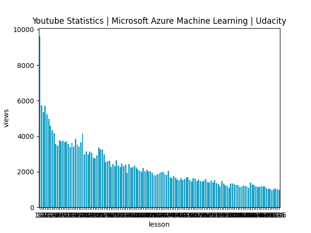
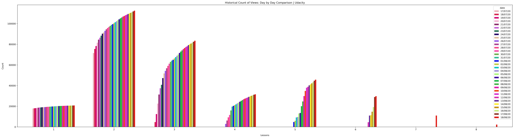

# Youtube Statistics | Microsoft Azure Machine Learning | Udacity

<b>Description:</b>
    
The app gather the information from Youtube API. The information are stored into .csv files. 
Pandas, Matplotlin and seaborn used to create plot from the availlable data.

<b>Structure:</b>

- resource (Resource files related to project are available here)
    - [udacity_azure.json](./resource/udacity_azure.json) (Json file of youtube videos in udacity)
    - [udacity_view_data.csv](./resource/udacity_view_data.csv) (Scrapped youtube views data)
- screenshots (Screenshots related to project)
- client_secret.json (client_secret file that will be available when you go through the below requirements)
- [config.py](config.py) (Configuration file)
- [plot_test.py](plot_test.py) (Testing code)
- [README.md](README.md) (Me)
- [video_stats.py](video_stats.py) (driver file which generates the plot)
- [youtube.py](youtube.py) (Youtube Data API code)

<b>Requirements:</b>

- [Youtube Data API](https://developers.google.com/youtube/v3/docs/videos/list)

- Google OAuth Token (Native | Desktop)
    
    You have to to the [Developer Console](https://console.developers.google.com/apis/) and follow below steps
    1. Create Project
    2. Go to [Credentials](https://console.developers.google.com/apis/credentials?project=)
    3. Select [+Create Credentials]()
    4. Select OAuth Client ID
    5. Application Type = Desktop
    6. Download the client_secret.json and put it under the working directory.
    
- Run pip install -r requirements.txt to download python dependencies

<b>Command:</b>
    
    python3 video_stats.py
    
<b>Output: </b>

<b>Historical Udacity Views Plot (Grouped by lesson)</b>

      

<b>Historical Udacity Progress Plot (Grouped by lesson) <b>

      
